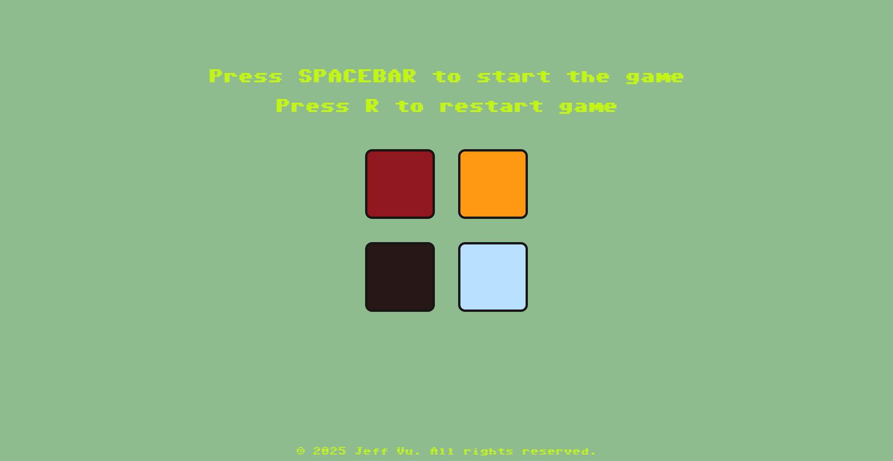

# Button Recall Challenge (link included)
This is a fun and simple memory game, use this to test your memorization skills!

## How to play!
**Step 1.** Press the `Space Bar` to start the game.  
**Step 2.** Watch the lights flash on each button color and memorize the sequence.  
**Step 3.** Attempt to recreate the sequence by pressing the buttons in the correct order. Don't press the wrong button! If you make a mistake, you lose.
 
*In each round, one new button will be added to the sequence. You must memorize and repeat the sequence correctly to win!*

### Try it here
` <insert link here> `

### License
This project is licensed under the MIT License